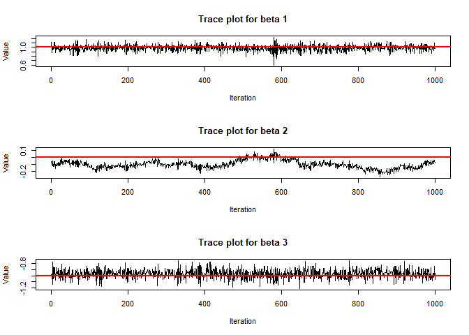
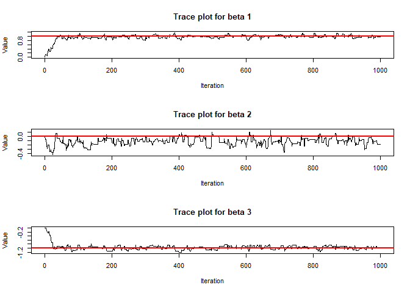

<!-- README.md is generated from README.Rmd. Please edit that file -->

# NegBinomHMC

<!-- badges: start -->
<!-- badges: end -->

NegBinomHMC is an R package that implements Hamiltonian Monte Carlo
(HMC) sampling for Bayesian Negative Binomial regression models. The
package provides functions to simulate Negative Binomial data, calculate
log-posterior densities and gradients, and perform adaptive HMC sampling
with a warmup phase to tune the step size automatically.

## Overview

Negative Binomial regression is commonly used for modeling
over-dispersed count data. With NegBinomHMC, you can:

- **Simulate Data:** Generate synthetic datasets following a Negative
  Binomial distribution using a specified regression model.

- **Model Evaluation:** Calculate the log-posterior and its gradient for
  your Negative Binomial regression model.

- **Adaptive HMC Sampling:** Sample from the Bayesian posterior using an
  adaptive HMC sampler that tunes its step size during a warmup period
  to achieve a desired acceptance rate.

This package is intended for educational purposes and as a starting
point for more advanced Bayesian inference in count data models.

## Package Structure

``` bash
NegBinomHMC/
├── DESCRIPTION       # Package metadata
├── NAMESPACE         # Exports information generated by roxygen2
├── R/
│   ├── simulation.R       # Data simulation function
│   ├── negbin_model.R             # Negative Binomial model function
│   ├── hmc_sampler.R                # Adaptive HMC sampler and helper functions
|   ├── rw_metropolis_model.R       # Random walk Metropolis model
├── man/              # Documentation files (generated via roxygen2)
├── README.md         # This file
└── LICENSE           # License file
```

## Installation

You can install the development version of NegBinomHMC from
[GitHub](https://github.com/) with:

``` r
# install.packages("devtools")
devtools::install_github("Kumachar/NegBinomHMC")
```

## New Features: Dual Averaging for Adaptive Epsilon

### Concept

Dual averaging is a robust method to adapt `epsilon` by targeting a
desired acceptance rate (denoted $\delta$, e.g., 0.65). It updates
`epsilon` iteratively to minimize the difference between the actual and
target acceptance probabilities. The algorithm:

1.  Runs HMC iterations, computing the acceptance probability $\alpha_t$
    at iteration $t$.
2.  Updates a running statistic to adjust $\log \epsilon$.
3.  Smooths the updates to stabilize convergence.

The update rules (from Hoffman & Gelman, 2014, used in NUTS) are:

$$
H_t = \left(1 - \frac{1}{t + t_0}\right) H_{t-1} + \frac{1}{t + t_0} (\delta - \alpha_t),
$$

$$
\log \tilde{\epsilon}_t = \mu - \frac{\sqrt{t}}{\gamma} H_t,
$$

$$
\log \epsilon_t = \kappa \log \tilde{\epsilon}_t + (1 - \kappa) \log \epsilon_{t-1},
$$

where:

- $\alpha_t$: Acceptance probability at iteration $t$.
- $\delta$: Target acceptance rate (e.g., 0.65).
- $H_t$: Running statistic tracking the error in acceptance rate.
- $\mu$: Initial guess for $\log \epsilon$.
- $t_0$: Controls early iteration weighting (e.g., 10).
- $\gamma$: Controls adaptation speed (e.g., 0.05).
- $\kappa$: Smoothing parameter (e.g., 0.75).
- $\epsilon_t$: Step size at iteration $t$.

After a warm-up phase, we fix `epsilon` to the final adapted value for
the sampling phase to ensure Markov chain validity.

## Simulation Example

Below is a basic example demonstrating how to simulate Negative
Binomials data and run the adaptive HMC sampler to estimate the
regression coefficients.

``` r
library(NegBinomHMC)
library(coda)

# Set simulation parameters
n <- 200              # Number of observations
p <- 3                # Number of predictors (including intercept)
beta_true <- c(1, 0, -1)  # True regression coefficients
r <- 2                # Dispersion parameter

# Simulate Negative Binomial data
data <- simulate_negbin_data(n, p, beta_true, r, seed = 123)
X <- data$X
y <- data$y

# Run the adaptive HMC sampler
start_time <- Sys.time()
result <- hmc_sampler(
  log_post = log_posterior_negbin,
  grad_log_post = grad_log_posterior_negbin,
  initial_beta = rep(0, p),
  initial_epsilon = 0.01,
  L = 10,
  n_iter = 1000,
  n_warmup = 500,
  X = X,
  y = y,
  r = r,
  beta_mu = 0,
  beta_sigma = 1,
  target_accept = 0.6
)
end_time <- Sys.time()
print(paste("HMC runtime:", end_time - start_time))
#> [1] "HMC runtime: 0.372952938079834"
cat("True beta:", beta_true, "\n")
#> True beta: 1 0 -1
cat("Estimated beta (mean):", colMeans(result$samples), "\n")
#> Estimated beta (mean): 0.9857302 -0.101327 -0.9700795
cat("Acceptance rate:", result$acceptance_rate, "\n")
#> Acceptance rate: 0.7466667
cat("Final epsilon:", result$final_epsilon, "\n")
#> Final epsilon: 0.08763474

# Posterior summaries
posterior_samples <- result$samples
colnames(posterior_samples) <- paste0("beta_", 1:p)
summary(posterior_samples)
#>      beta_1           beta_2             beta_3       
#>  Min.   :0.5918   Min.   :-0.27955   Min.   :-1.2122  
#>  1st Qu.:0.9385   1st Qu.:-0.14164   1st Qu.:-1.0222  
#>  Median :0.9872   Median :-0.10666   Median :-0.9690  
#>  Mean   :0.9857   Mean   :-0.10133   Mean   :-0.9701  
#>  3rd Qu.:1.0342   3rd Qu.:-0.06666   3rd Qu.:-0.9148  
#>  Max.   :1.2280   Max.   : 0.11570   Max.   :-0.7548

#Effective sample size
mcmc_chain <- as.mcmc(posterior_samples)
# Calculate effective sample size for each parameter
ess <- effectiveSize(mcmc_chain)

# Display the effective sample sizes
print("Effective Sample Size:")
#> [1] "Effective Sample Size:"
print(ess)
#>      beta_1      beta_2      beta_3 
#> 1943.104478    7.238143 1217.820448

# Length of CI
ci_length <- apply(posterior_samples, 2, function(x) {
  quantile(x, 0.975) - quantile(x, 0.025)
})
print("Length of 95% CI for each parameter:")
#> [1] "Length of 95% CI for each parameter:"
print( ci_length)
#>    beta_1    beta_2    beta_3 
#> 0.2673753 0.2288583 0.2981192


# Trace plot
par(mfrow = c(p, 1))
for (j in 1:p) {
  plot(posterior_samples[, j], type = "l", 
       main = paste("Trace plot for beta", j), ylab = "Value", xlab = "Iteration")
  abline(h = beta_true[j], col = "red", lwd = 2)
}
```



``` r
## Random Walk Metropolis Example
# Prior hyperparameters: using N(0, 10^2) for each beta coefficient.
beta_mu <- 0
beta_sigma <- 1  # In this example, we set sigma=1; adjust as needed.

# Initial beta: starting at zero (vector of length p)
init_beta <- rep(0, p)

# Sampler settings
iterations <- 1000
proposal_sd <- 0.1  # Standard deviation for each proposal increment

# Run the sampler
start_time <- Sys.time()
chain_metropolis <- rw_metropolis(
  log_post    = log_posterior_negbin,
  init        = init_beta,
  iterations  = iterations,
  proposal_sd = proposal_sd,
  X           = X,
  y           = y,
  r           = r,
  beta_mu     = beta_mu,
  beta_sigma  = beta_sigma
)
end_time <- Sys.time()
rwm_runtime <- end_time - start_time
print(paste("Random Walk Metropolis runtime:", rwm_runtime))
#> [1] "Random Walk Metropolis runtime: 0.0449690818786621"

#Results for Random-walk Metropolis
cat("Estimated beta (mean):", colMeans(chain_metropolis), "\n")
#> Estimated beta (mean): 0.9625975 -0.1157146 -0.9633575
cat("Acceptance rate:", mean(diff(chain_metropolis) != 0), "\n")
#> Acceptance rate: 0.3303303

# Posterior summaries
posterior_samples_metropolis <- chain_metropolis
colnames(posterior_samples_metropolis) <- paste0("beta_", 1:p)
summary(posterior_samples_metropolis)
#>      beta_1           beta_2             beta_3         
#>  Min.   :0.0000   Min.   :-0.42520   Min.   :-1.217567  
#>  1st Qu.:0.9369   1st Qu.:-0.17258   1st Qu.:-1.037868  
#>  Median :0.9821   Median :-0.11458   Median :-0.974299  
#>  Mean   :0.9626   Mean   :-0.11571   Mean   :-0.963357  
#>  3rd Qu.:1.0206   3rd Qu.:-0.05376   3rd Qu.:-0.907336  
#>  Max.   :1.1727   Max.   : 0.13776   Max.   : 0.001467
# Trace plot
par(mfrow = c(p, 1))

# Effective sample size
mcmc_chain <- as.mcmc(chain_metropolis)

# Length of CI

ci_length <- apply(posterior_samples_metropolis, 2, function(x) {
  quantile(x, 0.975) - quantile(x, 0.025)
})
print("Length of 95% CI for each parameter:")
#> [1] "Length of 95% CI for each parameter:"
print( ci_length)
#>    beta_1    beta_2    beta_3 
#> 0.4744858 0.3462910 0.3438163

# Calculate effective sample size for each parameter
print("Effective Sample Size:")
#> [1] "Effective Sample Size:"
ess <- effectiveSize(mcmc_chain)

# Display the effective sample sizes
print(ess)
#>     var1     var2     var3 
#> 33.12578 80.90123 45.63242


for (j in 1:p) {
  plot(posterior_samples_metropolis[, j], type = "l", 
       main = paste("Trace plot for beta", j), ylab = "Value", xlab = "Iteration")
  abline(h = beta_true[j], col = "red", lwd = 2)
}
```



## Real-World Example 1

In this analysis, we investigate the factors influencing the number of
days of absence among high school juniors. The data come from a study
involving school administrators, where the predictors include the type
of program in which a student is enrolled and a standardized math test
score. Due to possible overdispersion in the count data, a Negative
Binomial model is appropriate compared to a Poisson model.

We use our HMC package (NegBinomHMC) to sample from the posterior
distribution of a Negative Binomial regression model. This document
details the steps for reading in the data, building the design matrix,
running the HMC sampler, and comparing the results with a baseline
model.

### Data Reading and Preprocessing

We start by reading the dataset using the `haven` package. The dataset
is stored in a Stata file and contains variables such as `math`
(standardized test score), `prog` (program type), and `daysabs` (number
of absence days). We convert the program type to a factor variable for
modeling.

``` r
library(haven)
library(NegBinomHMC)
dat <- read_dta("https://stats.idre.ucla.edu/stat/stata/dae/nb_data.dta")
dat <- within(dat, {
  prog <- factor(prog, levels = 1:3, labels = c("General", "Academic", "Vocational"))
  id <- factor(id)
})

head(dat)
#> # A tibble: 6 × 5
#>   id    gender      math daysabs prog    
#>   <fct> <dbl+lbl>  <dbl>   <dbl> <fct>   
#> 1 1001  2 [male]      63       4 Academic
#> 2 1002  2 [male]      27       4 Academic
#> 3 1003  1 [female]    20       2 Academic
#> 4 1004  1 [female]    16       3 Academic
#> 5 1005  1 [female]     2       3 Academic
#> 6 1006  1 [female]    71      13 Academic

X <- model.matrix(~ math + prog, data = dat)
y <- dat$daysabs
r <- 2
p <- ncol(X)
# Define the log-posterior function for the negative binomial model
# Fit a negative binomial regression model

result <- hmc_sampler(
  log_post = log_posterior_negbin,
  grad_log_post = grad_log_posterior_negbin,
  initial_beta = rep(0, p),
  initial_epsilon = 0.01,
  L = 10,
  n_iter = 1000,
  n_warmup = 500,
  X = X,
  y = y,
  r = r,
  beta_mu = 0,
  beta_sigma = 1,
  target_accept = 0.6
)

cat("Estimated beta (mean):", colMeans(result$samples), "\n")
#> Estimated beta (mean): 1.902437 -0.006174328 0.3706828 -0.4976668
cat("Acceptance rate:", result$acceptance_rate, "\n")
#> Acceptance rate: 0.1986667
cat("Final epsilon:", result$final_epsilon, "\n")
#> Final epsilon: 0.002117516
```

## Real-World Example 2

In this analysis, we investigate the factors influencing the total
number of injuries in traffic accidents. The data come from a traffic
accidents dataset and include predictors such as lighting condition,
number of units involved, day of the week, and month of the crash.
Considering possible overdispersion in the count data, we use a Negative
Binomial regression model. This document demonstrates how to fit the
model using both a traditional approach (via `glm.nb` from the MASS
package) and our custom Hamiltonian Monte Carlo (HMC) sampler.

### Data Preprocessing

We start by reading in the `traffic_accidents.csv` file. The categorical
variables are converted to factors, and numerical values (e.g., number
of units) are properly set as numeric.

``` r
library(NegBinomHMC)
accidents <- read.csv("ExampleData/traffic_accidents.csv", stringsAsFactors = TRUE)

accidents$weather_condition <- as.factor(accidents$weather_condition)
accidents$lighting_condition <- as.factor(accidents$lighting_condition)
accidents$crash_day_of_week <- as.factor(accidents$crash_day_of_week)
accidents$crash_month <- as.factor(accidents$crash_month)
accidents$num_units <- as.numeric(as.character(accidents$num_units))

library(MASS)
nb_model <- glm.nb(injuries_total ~ lighting_condition + num_units +
                     crash_day_of_week + crash_month,
                   data = accidents)
summary(nb_model)
#> 
#> Call:
#> glm.nb(formula = injuries_total ~ lighting_condition + num_units + 
#>     crash_day_of_week + crash_month, data = accidents, init.theta = 0.7415346039, 
#>     link = log)
#> 
#> Coefficients:
#>                                           Estimate Std. Error z value Pr(>|z|)
#> (Intercept)                              -2.042339   0.035051 -58.267  < 2e-16
#> lighting_conditionDARKNESS, LIGHTED ROAD  0.104313   0.024323   4.289 1.80e-05
#> lighting_conditionDAWN                   -0.049675   0.039932  -1.244 0.213509
#> lighting_conditionDAYLIGHT               -0.152928   0.023708  -6.451 1.11e-10
#> lighting_conditionDUSK                   -0.105643   0.034319  -3.078 0.002082
#> lighting_conditionUNKNOWN                -0.931136   0.048197 -19.319  < 2e-16
#> num_units                                 0.551718   0.008847  62.359  < 2e-16
#> crash_day_of_week2                       -0.123353   0.017131  -7.200 6.00e-13
#> crash_day_of_week3                       -0.161773   0.016949  -9.544  < 2e-16
#> crash_day_of_week4                       -0.133067   0.016857  -7.894 2.93e-15
#> crash_day_of_week5                       -0.161886   0.016827  -9.621  < 2e-16
#> crash_day_of_week6                       -0.194597   0.016417 -11.854  < 2e-16
#> crash_day_of_week7                       -0.115257   0.016531  -6.972 3.12e-12
#> crash_month2                             -0.068891   0.024004  -2.870 0.004105
#> crash_month3                              0.072389   0.023209   3.119 0.001815
#> crash_month4                              0.137530   0.023104   5.953 2.64e-09
#> crash_month5                              0.186414   0.022190   8.401  < 2e-16
#> crash_month6                              0.198024   0.022031   8.989  < 2e-16
#> crash_month7                              0.240459   0.021883  10.988  < 2e-16
#> crash_month8                              0.200943   0.021839   9.201  < 2e-16
#> crash_month9                              0.194849   0.021662   8.995  < 2e-16
#> crash_month10                             0.154989   0.021457   7.223 5.08e-13
#> crash_month11                             0.080318   0.022054   3.642 0.000271
#> crash_month12                             0.017377   0.022093   0.787 0.431551
#>                                             
#> (Intercept)                              ***
#> lighting_conditionDARKNESS, LIGHTED ROAD ***
#> lighting_conditionDAWN                      
#> lighting_conditionDAYLIGHT               ***
#> lighting_conditionDUSK                   ** 
#> lighting_conditionUNKNOWN                ***
#> num_units                                ***
#> crash_day_of_week2                       ***
#> crash_day_of_week3                       ***
#> crash_day_of_week4                       ***
#> crash_day_of_week5                       ***
#> crash_day_of_week6                       ***
#> crash_day_of_week7                       ***
#> crash_month2                             ** 
#> crash_month3                             ** 
#> crash_month4                             ***
#> crash_month5                             ***
#> crash_month6                             ***
#> crash_month7                             ***
#> crash_month8                             ***
#> crash_month9                             ***
#> crash_month10                            ***
#> crash_month11                            ***
#> crash_month12                               
#> ---
#> Signif. codes:  0 '***' 0.001 '**' 0.01 '*' 0.05 '.' 0.1 ' ' 1
#> 
#> (Dispersion parameter for Negative Binomial(0.7415) family taken to be 1)
#> 
#>     Null deviance: 154736  on 209305  degrees of freedom
#> Residual deviance: 149258  on 209282  degrees of freedom
#> AIC: 334924
#> 
#> Number of Fisher Scoring iterations: 1
#> 
#> 
#>               Theta:  0.74153 
#>           Std. Err.:  0.00925 
#> 
#>  2 x log-likelihood:  -334874.20000

nb_formula <- injuries_total ~ lighting_condition + num_units + crash_day_of_week + crash_month
X <- model.matrix(nb_formula, data = accidents)
y <- accidents$injuries_total

r <- 0.74
beta_mu <- rep(0, ncol(X))
beta_sigma <- rep(10, ncol(X))

initial_beta <- rep(0, ncol(X))

initial_epsilon <- 0.1 
L <- 10 
n_iter <- 1000
n_warmup <- 500
target_accept <- 0.65

hmc_result <- hmc_sampler(
  log_post = log_posterior_negbin,
  grad_log_post = grad_log_posterior_negbin,
  initial_beta = initial_beta,
  initial_epsilon = initial_epsilon,
  L = L,
  n_iter = n_iter,
  n_warmup = n_warmup,
  X = X,
  y = y,
  r = r,
  beta_mu = beta_mu,
  beta_sigma = beta_sigma,
  target_accept = target_accept
)

samples <- hmc_result$samples
accept_rate <- hmc_result$acceptance_rate
final_epsilon <- hmc_result$final_epsilon

cat("HMC acceptance rate:", accept_rate, "\n")
#> HMC acceptance rate: 0.77
cat("final epsilon:", final_epsilon, "\n")
#> final epsilon: 0.002352611

posterior_means <- colMeans(samples)
cat("HMC posterior mean：\n")
#> HMC posterior mean：
print(posterior_means)
#>  [1] -2.03647089  0.10335490 -0.05196786 -0.15374859 -0.10501588 -0.93278662
#>  [7]  0.55068760 -0.12486118 -0.16355794 -0.13446035 -0.16372417 -0.19589568
#> [13] -0.11675803 -0.07072025  0.07084653  0.13546341  0.18532619  0.19737446
#> [19]  0.23900509  0.19964439  0.19392164  0.15324451  0.07826874  0.01553934

cat("glm model estimated coefficients：\n")
#> glm model estimated coefficients：
print(coef(nb_model))
#>                              (Intercept) 
#>                              -2.04233876 
#> lighting_conditionDARKNESS, LIGHTED ROAD 
#>                               0.10431344 
#>                   lighting_conditionDAWN 
#>                              -0.04967474 
#>               lighting_conditionDAYLIGHT 
#>                              -0.15292814 
#>                   lighting_conditionDUSK 
#>                              -0.10564299 
#>                lighting_conditionUNKNOWN 
#>                              -0.93113615 
#>                                num_units 
#>                               0.55171830 
#>                       crash_day_of_week2 
#>                              -0.12335267 
#>                       crash_day_of_week3 
#>                              -0.16177324 
#>                       crash_day_of_week4 
#>                              -0.13306748 
#>                       crash_day_of_week5 
#>                              -0.16188641 
#>                       crash_day_of_week6 
#>                              -0.19459695 
#>                       crash_day_of_week7 
#>                              -0.11525677 
#>                             crash_month2 
#>                              -0.06889150 
#>                             crash_month3 
#>                               0.07238907 
#>                             crash_month4 
#>                               0.13752991 
#>                             crash_month5 
#>                               0.18641419 
#>                             crash_month6 
#>                               0.19802407 
#>                             crash_month7 
#>                               0.24045914 
#>                             crash_month8 
#>                               0.20094291 
#>                             crash_month9 
#>                               0.19484940 
#>                            crash_month10 
#>                               0.15498857 
#>                            crash_month11 
#>                               0.08031843 
#>                            crash_month12 
#>                               0.01737741

ci_length <- apply(samples, 2, function(x) {
  quantile(x, 0.975) - quantile(x, 0.025)
})
print("Length of 95% CI for each parameter:")
#> [1] "Length of 95% CI for each parameter:"
print(ci_length)
#>  [1] 0.12586756 0.08794023 0.14680625 0.08724283 0.13665972 0.18972666
#>  [7] 0.03600563 0.06950765 0.06622217 0.06869137 0.06736958 0.06483087
#> [13] 0.07032123 0.10251326 0.09199487 0.08950584 0.09014538 0.09027470
#> [19] 0.08816141 0.08531449 0.08661121 0.09107790 0.09443526 0.09149120


# Metropolis model
## Random Walk Metropolis Example
# Prior hyperparameters: using N(0, 10^2) for each beta coefficient.
beta_mu <- 0
beta_sigma <- 1  # In this example, we set sigma=1; adjust as needed.

# Initial beta: starting at zero (vector of length p)
proposal_sd <- 0.1
iterations <- 1000

chain_metropolis <- rw_metropolis(
  log_post = log_posterior_negbin,
  init = initial_beta,
  iterations = iterations,
  proposal_sd = proposal_sd,
  X = X,
  y = y,
  r = r,
  beta_mu = beta_mu,
  beta_sigma = beta_sigma
)

cat("Random Walk Metropolis acceptance rate:", mean(diff(chain_metropolis) != 0), "\n")
#> Random Walk Metropolis acceptance rate: 0.02802803
cat("Random Walk Metropolis posterior mean：\n")
#> Random Walk Metropolis posterior mean：
print(colMeans(chain_metropolis))
#>  [1] -1.060384109  0.009815559 -0.147515341 -0.283283709 -0.222347967
#>  [6] -0.391487583  0.249149414 -0.155903797 -0.162312955 -0.218263403
#> [11] -0.194385119 -0.280619494 -0.131255941 -0.064928272 -0.083335460
#> [16] -0.065789248 -0.081008720  0.218748968 -0.033343195  0.106777933
#> [21] -0.081251588 -0.111895116 -0.085212160 -0.130615423

ci_length <- apply(chain_metropolis, 2, function(x) {
  quantile(x, 0.975) - quantile(x, 0.025)
})
print("Length of 95% CI for each parameter:")
#> [1] "Length of 95% CI for each parameter:"
print( ci_length)
#>  [1] 0.8705835 0.2959814 0.6721309 0.3473314 0.4279881 0.8882957 0.4752401
#>  [8] 0.2657398 0.2692784 0.3868275 0.4574971 0.4432469 0.5031121 0.6455981
#> [15] 0.5130934 0.7547416 0.2646949 1.0346993 0.4200339 0.3677683 0.2987375
#> [22] 0.3571136 0.6439414 0.5250106
```

## Contributing

Contributions to NegBinomHMC are welcome. If you encounter issues or
have suggestions for improvements, please feel free to open an issue or
submit a pull request on the GitHub repository.

## License

This project is licensed under the MIT License. See the LICENSE file for
details.

## Contact

For questions or further information, please contact Weixiong at
\[<wxhua@umich.edu>\].
