<!-- README.md is generated from README.Rmd. Please edit that file -->

# NegBinomHMC

<!-- badges: start -->
<!-- badges: end -->

NegBinomHMC is an R package that implements Hamiltonian Monte Carlo
(HMC) sampling for Bayesian Negative Binomial regression models. The
package provides functions to simulate Negative Binomial data, calculate
log-posterior densities and gradients, and perform adaptive HMC sampling
with a warmup phase to tune the step size automatically.

## Overview

Negative Binomial regression is commonly used for modeling
over-dispersed count data. With NegBinomHMC, you can:

- **Simulate Data:** Generate synthetic datasets following a Negative
  Binomial distribution using a specified regression model.

- **Model Evaluation:** Calculate the log-posterior and its gradient for
  your Negative Binomial regression model.

- **Adaptive HMC Sampling:** Sample from the Bayesian posterior using an
  adaptive HMC sampler that tunes its step size during a warmup period
  to achieve a desired acceptance rate.

This package is intended for educational purposes and as a starting
point for more advanced Bayesian inference in count data models.

## Package Structure

``` bash
NegBinomHMC/
├── DESCRIPTION       # Package metadata
├── NAMESPACE         # Exports information generated by roxygen2
├── R/
│   ├── simulation.R       # Data simulation function
│   ├── negbin_model.R             # Negative Binomial model function
│   ├── hmc_sampler.R                # Adaptive HMC sampler and helper functions
├── man/              # Documentation files (generated via roxygen2)
├── README.md         # This file
└── LICENSE           # License file
```

## Installation

You can install the development version of NegBinomHMC from
[GitHub](https://github.com/) with:

``` r
# install.packages("devtools")
devtools::install_github("Kumachar/NegBinomHMC")
```

And we strongly suggest users to install and run this package on
Greatlakes, biostat cluster, or any local R environment with at least
16GB of RAM to avoid any possible issues.

## New Features: Dual Averaging for Adaptive Epsilon

### Concept

Dual averaging is a robust method to adapt `epsilon` by targeting a
desired acceptance rate (denoted $\delta$, e.g., 0.65). It updates
`epsilon` iteratively to minimize the difference between the actual and
target acceptance probabilities. The algorithm:

1.  Runs HMC iterations, computing the acceptance probability $\alpha_t$
    at iteration $t$.
2.  Updates a running statistic to adjust $\log \epsilon$.
3.  Smooths the updates to stabilize convergence.

The update rules (from Hoffman & Gelman, 2014, used in NUTS) are:

$$
H_t = \left(1 - \frac{1}{t + t_0}\right) H_{t-1} + \frac{1}{t + t_0} (\delta - \alpha_t),
$$

$$
\log \tilde{\epsilon}_t = \mu - \frac{\sqrt{t}}{\gamma} H_t,
$$

and,

$$
\log \epsilon_t = \kappa \log \tilde{\epsilon}_t + (1 - \kappa) \log \epsilon_{t-1},
$$

where:

- $\alpha_t$: Acceptance probability at iteration $t$.
- $\delta$: Target acceptance rate (e.g., 0.65).
- $H_t$: Running statistic tracking the error in acceptance rate.
- $\mu$: Initial guess for $\log \epsilon$.
- $t_0$: Controls early iteration weighting (e.g., 10).
- $\gamma$: Controls adaptation speed (e.g., 0.05).
- $\kappa$: Smoothing parameter (e.g., 0.75).
- $\epsilon_t$: Step size at iteration $t$.

After a warm-up phase, we fix `epsilon` to the final adapted value for
the sampling phase to ensure Markov chain validity.

## Simulation Example

Below is a basic example demonstrating how to simulate Negative
Binomials data and run the adaptive HMC sampler to estimate the
regression coefficients. You can play with example by altering the
params. To contrast the result we used a package called `MCMCpack` to
run a random walk Metropolis sampler. It provides a function called
`MCMCnegbin` to fit a Negative Binomial regression model using a random
walk Metropolis algorithm. Unlike our approach, it estimates the
dispersion parameter `r` based on the outcome of generalized linear
model (GLM). `MCMCnegbin` fails to provide valid estimates of `r` when
the number of observations is less than 200 (not converge) or over 2000
(takes too many memories), while our HMC sampler can handle a larger
range of observations. Here we set the number of observations to 500,
which is a good trade-off between speed and accuracy. You can also try
to increase the number of observations to 2000 and see the difference of
these two methods.

``` r
library(NegBinomHMC)
library(coda)
set.seed(123)

# Set simulation parameters
n <- 500              # Number of observations
p <- 3                # Number of predictors (including intercept)
beta_true <- c(3, 5, -3)  # True regression coefficients
r_true <- 2           # True dispersion parameter

# Simulate Negative Binomial data
data <- simulate_negbin_data(n, p, beta_true, r_true, seed = 123)
X <- data$X
y <- data$y
df <- data.frame(
  y  = y,
  x1 = X[, 2],          # drop the intercept column
  x2 = X[, 3]
)

# Prior hyperparameters
beta_mu <- rep(0, p)
beta_sigma <- rep(1, p)
alpha_r <- 5    # Stronger prior to avoid small r
beta_r <- 2     # Prior mean = 5/2 = 2.5, variance = 5/4 = 1.25

# Run the adaptive HMC sampler
initial_beta <- rep(0, p)  # Initial beta coefficients
initial_beta[3] <- -1
initial_theta <- c(initial_beta, log(2))  # Initial beta, phi = log(2)
start_time <- Sys.time()
result <- hmc_sampler(
  log_post = log_posterior_negbin_log_r,
  grad_log_post = grad_log_posterior_negbin_log_r,
  initial_theta = initial_theta,
  initial_epsilon = 0.005,  # Smaller step size
  L = 20,                   # More leapfrog steps
  n_iter = 10000,
  n_warmup = 2000,
  X = X,
  y = y,
  beta_mu = beta_mu,
  beta_sigma = beta_sigma,
  alpha_r = alpha_r,
  beta_r = beta_r,
  target_accept = 0.8
)
end_time <- Sys.time()
print(paste("HMC runtime:", end_time - start_time))
#> [1] "HMC runtime: 20.7962441444397"

# Transform phi samples back to r for reporting
r_samples <- exp(result$samples[, p + 1])

# Results
cat("True beta:", beta_true, "\n")
#> True beta: 3 5 -3
cat("True r:", r_true, "\n")
#> True r: 2
cat("Estimated beta (mean):", colMeans(result$samples[, 1:p]), "\n")
#> Estimated beta (mean): 2.941571 5.060576 -3.00952
cat("Estimated r (mean):", mean(r_samples), "\n")
#> Estimated r (mean): 2.068144
cat("Acceptance rate:", result$acceptance_rate, "\n")
#> Acceptance rate: 0.8515833
cat("Final epsilon:", result$final_epsilon, "\n")
#> Final epsilon: 0.04733762

# Posterior summaries
posterior_samples <- cbind(result$samples[, 1:p], r_samples)
colnames(posterior_samples) <- c(paste0("beta_", 1:p), "r")
summary(posterior_samples)
#>      beta_1          beta_2          beta_3             r        
#>  Min.   :2.779   Min.   :4.879   Min.   :-3.176   Min.   :1.637  
#>  1st Qu.:2.909   1st Qu.:5.026   1st Qu.:-3.038   1st Qu.:1.954  
#>  Median :2.942   Median :5.061   Median :-3.009   Median :2.063  
#>  Mean   :2.942   Mean   :5.061   Mean   :-3.010   Mean   :2.068  
#>  3rd Qu.:2.974   3rd Qu.:5.094   3rd Qu.:-2.981   3rd Qu.:2.169  
#>  Max.   :3.128   Max.   :5.246   Max.   :-2.850   Max.   :2.667

# Effective sample size
mcmc_chain <- as.mcmc(posterior_samples)
ess <- effectiveSize(mcmc_chain)
print("Effective Sample Size:")
#> [1] "Effective Sample Size:"
print(ess)
#>      beta_1      beta_2      beta_3           r 
#> 19407.49675  1732.59616   549.54072    40.55465

# Length of 95% CI
ci_length <- apply(posterior_samples, 2, function(x) {
  quantile(x, 0.975) - quantile(x, 0.025)
})
print("Length of 95% CI for each parameter:")
#> [1] "Length of 95% CI for each parameter:"
print(ci_length)
#>    beta_1    beta_2    beta_3         r 
#> 0.1896343 0.1943844 0.1667984 0.6384984


par(mfrow = c(2, 3), mar = c(4, 4, 2, 1))
# Trace plot
for (j in 1:p) {
  plot(result$samples[, j], type = "l", 
       main = paste("Trace plot for beta", j),
       xlab = "Iteration",
       ylab = "Value")
  abline(h = beta_true[j], col = "red", lwd = 2)
}

# Density plot
for (j in 1:p) {
  plot(density(result$samples[, j]), 
       main = paste("Density plot for beta", j),
       xlab = "Value",
       ylab = "Density")
  abline(v = beta_true[j], col = "red", lwd = 2)
}
```

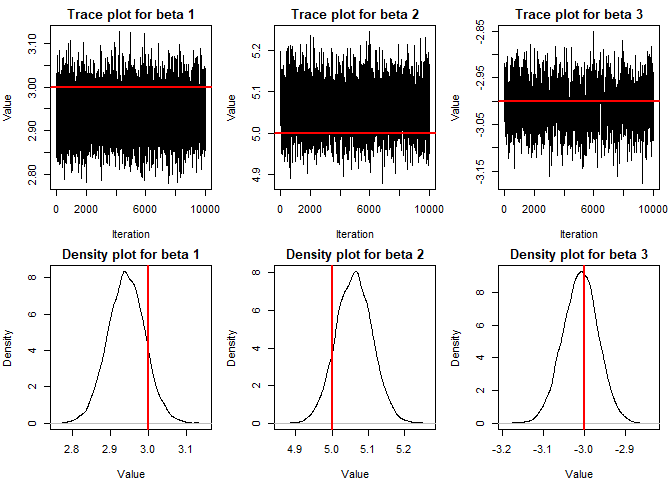

``` r
par(mfrow = c(1, 2))
plot(r_samples, type = "l", 
     main = "Trace plot for r", ylab = "Value", xlab = "Iteration")
abline(h = r_true, col = "red", lwd = 2)
plot(density(r_samples), 
     main = "Density plot for r",
     xlab = "Value",
     ylab = "Density")
abline(v = r_true, col = "red", lwd = 2)
```

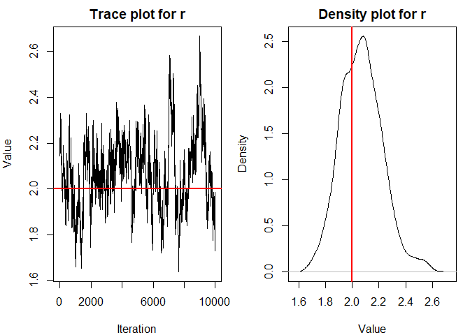

``` r

par(mfrow = c(1, 1))
```

``` r
library(MCMCpack)
#> 载入需要的程序包：MASS
#> ##
#> ## Markov Chain Monte Carlo Package (MCMCpack)
#> ## Copyright (C) 2003-2025 Andrew D. Martin, Kevin M. Quinn, and Jong Hee Park
#> ##
#> ## Support provided by the U.S. National Science Foundation
#> ## (Grants SES-0350646 and SES-0350613)
#> ##
nb_draws <- MCMCnegbin(y ~ x1 + x2,          
                       data   = df,
                       burnin = 5e3,
                       mcmc   = 2e4,
                       thin   = 1,
                       seed   = 123)

summary(nb_draws)       # β’s and ρ (size) are already separated
#> 
#> Iterations = 5001:25000
#> Thinning interval = 1 
#> Number of chains = 1 
#> Sample size per chain = 20000 
#> 
#> 1. Empirical mean and standard deviation for each variable,
#>    plus standard error of the mean:
#> 
#>               Mean       SD  Naive SE Time-series SE
#> (Intercept)  2.949 0.020847 1.474e-04       0.009906
#> x1           5.063 0.006684 4.726e-05       0.002995
#> x2          -3.013 0.004798 3.392e-05       0.002473
#> 
#> 2. Quantiles for each variable:
#> 
#>               2.5%    25%    50%    75%  97.5%
#> (Intercept)  2.907  2.933  2.953  2.965  2.985
#> x1           5.050  5.058  5.062  5.067  5.076
#> x2          -3.022 -3.018 -3.012 -3.009 -3.006

# Effective Sample Size
mcmc_chain <- as.mcmc(nb_draws)
ess <- effectiveSize(mcmc_chain)
print("Effective Sample Size:")
#> [1] "Effective Sample Size:"
print(ess)
#> (Intercept)          x1          x2 
#>    4.428784    4.980777    3.763099

nb_draws1 <- as.data.frame(nb_draws)
par(mfrow = c(2, 3), mar = c(4, 4, 2, 1))
# Trace plot
for (j in 1:p) {
  plot(nb_draws1[, j], type = "l", 
       main = paste("Trace plot for beta", j),
       xlab = "Iteration",
       ylab = "Value")
  abline(h = beta_true[j], col = "red", lwd = 2)
}

# Density plot
for (j in 1:p) {
  plot(density(nb_draws1[, j]), 
       main = paste("Density plot for beta", j),
       xlab = "Value",
       ylab = "Density")
  abline(v = beta_true[j], col = "red", lwd = 2)
}
```


## Real-World Example 1

In this analysis, we investigate the factors influencing the number of
days of absence among high school juniors. The data come from a study
involving school administrators, where the predictors include the type
of program in which a student is enrolled and a standardized math test
score. Due to possible overdispersion in the count data, a Negative
Binomial model is appropriate compared to a Poisson model.

We use our HMC package (NegBinomHMC) to sample from the posterior
distribution of a Negative Binomial regression model. This document
details the steps for reading in the data, building the design matrix,
running the HMC sampler, and comparing the results with a baseline
model.

### Data Reading and Preprocessing

We start by reading the dataset using the `haven` package. The dataset
is stored in a Stata file and contains variables such as `math`
(standardized test score), `prog` (program type), and `daysabs` (number
of absence days). We convert the program type to a factor variable for
modeling.

``` r
library(haven)
library(NegBinomHMC)
library(MCMCpack)
library(MASS)
library(ggplot2)

set.seed(123)
dat <- read_dta("https://stats.idre.ucla.edu/stat/stata/dae/nb_data.dta")
dat <- within(dat, {
  prog <- factor(prog, levels = 1:3,
                 labels = c("General","Academic","Vocational"))
  id <- factor(id)
})

# Design matrix and response
X <- model.matrix(~ math + prog, data = dat)
y <- dat$daysabs
p <- ncol(X)

# 1) Frequentist negative‑binomial
glm_fit <- glm.nb(daysabs ~ math + prog, data = dat)

# 2) HMC sampling
hmc_res <- hmc_sampler(
  log_post        = log_posterior_negbin_log_r,
  grad_log_post   = grad_log_posterior_negbin_log_r,
  initial_theta   = c(rep(0, p), log(10)),  # β=0, φ=log(10)
  initial_epsilon = 0.01,
  L               = 10,
  n_iter          = 10000,
  n_warmup        = 5000,
  X               = X, y = y,
  beta_mu         = 0,
  beta_sigma      = 1,
  alpha_r         = 5,
  beta_r          = 2,
  target_accept   = 0.5
)
hmc_samps <- hmc_res$samples
r_hmc     <- exp(hmc_samps[, p + 1])

# 3) Random‑walk Metropolis
rwm_chain <- MCMCnegbin(
  formula = daysabs ~ math + prog,
  data    = dat,
  burnin  = 0,
  mcmc    = 10000,
  tune    = 1,
  b0      = rep(0, p),
  B0      = diag(1, p),  # prior precision = 1 / 1²
  a0      = 5,
  c0      = 2,
  verbose = 0
)

# 4) Summaries: means & 95% CIs
params <- c(colnames(X), "r")

# HMC
hmc_means    <- c(colMeans(hmc_samps[, 1:p]),      mean(r_hmc))
hmc_ci_lower <- c(apply(hmc_samps[, 1:p], 2, quantile, probs = .025),
                   quantile(r_hmc, .025))
hmc_ci_upper <- c(apply(hmc_samps[, 1:p], 2, quantile, probs = .975),
                   quantile(r_hmc, .975))
names(hmc_means) <- names(hmc_ci_lower) <- names(hmc_ci_upper) <- params

# GLM
glm_means <- c(coef(glm_fit), r = glm_fit$theta)
conf_glm  <- confint(glm_fit)
#> Waiting for profiling to be done...
glm_ci_lower <- glm_ci_upper <- rep(NA, length(params))
names(glm_ci_lower) <- names(glm_ci_upper) <- params
for(nm in rownames(conf_glm)) {
  glm_ci_lower[nm] <- conf_glm[nm, 1]
  glm_ci_upper[nm] <- conf_glm[nm, 2]
}

# RWM
rwm_means    <- colMeans(rwm_chain)
rwm_ci_lower <- apply(rwm_chain, 2, quantile, probs = .025)
rwm_ci_upper <- apply(rwm_chain, 2, quantile, probs = .975)

# 5) Build long data.frame for β’s
df_beta <- data.frame(
  Parameter = rep(colnames(X), 3),
  Method    = factor(rep(c("HMC","GLM","RWM"), each = p),
                     levels = c("HMC","GLM","RWM")),
  Estimate  = c(hmc_means[colnames(X)],
                glm_means[colnames(X)],
                rwm_means[colnames(X)]),
  CI_Lower  = c(hmc_ci_lower[colnames(X)],
                glm_ci_lower[colnames(X)],
                rwm_ci_lower[colnames(X)]),
  CI_Upper  = c(hmc_ci_upper[colnames(X)],
                glm_ci_upper[colnames(X)],
                rwm_ci_upper[colnames(X)])
)
df_beta$Parameter <- factor(df_beta$Parameter, levels = colnames(X))

df_beta$CI_length <- df_beta$CI_Upper - df_beta$CI_Lower

# 6) Plot β’s with 95% CIs, add length of CIs
ggplot(df_beta, aes(x = Parameter, y = Estimate, color = Method)) +
  geom_point(position = position_dodge(width = 0.6), size = 3) +
  geom_errorbar(aes(ymin = CI_Lower, ymax = CI_Upper),
                position = position_dodge(width = 0.6), width = 0.2) +
  # label the CI length
  geom_text(aes(label = round(CI_length, 2),    # round as needed
                y     = CI_Upper),              # position text at top of bar
            position = position_dodge(width = 0.6),
            vjust    = -0.5,                    # nudge it a bit higher
            size     = 3) +                     # text size
  theme_bw() +
  theme(axis.text.x = element_text(angle = 45, hjust = 1)) +
  labs(title = "β Estimates with 95% CIs\n(Length of CI shown above)",
       x     = NULL,
       y     = "Estimate")
```

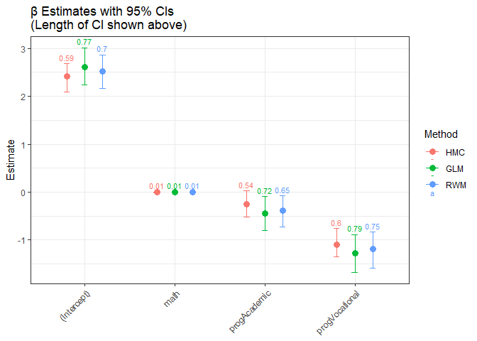

``` r

# 7) Plot dispersion “r”
df_r <- data.frame(
  Parameter = factor("r"),
  Method    = factor(c("HMC","GLM","RWM"),
                     levels = c("HMC","GLM","RWM")),
  Estimate  = c(hmc_means["r"], glm_means["r"], rwm_means["r"]),
  CI_Lower  = c(hmc_ci_lower["r"], glm_ci_lower["r"], rwm_ci_lower["r"]),
  CI_Upper  = c(hmc_ci_upper["r"], glm_ci_upper["r"], rwm_ci_upper["r"])
)

ggplot(df_r, aes(x = Parameter, y = Estimate, color = Method)) +
  geom_point(position = position_dodge(width = 0.3), size = 4) +
  geom_errorbar(aes(ymin = CI_Lower, ymax = CI_Upper),
                position = position_dodge(width = 0.3), width = 0.1) +
  theme_bw() +
  labs(title = "Dispersion (r) Estimates with 95% CIs", x = NULL, y = "Value")
```

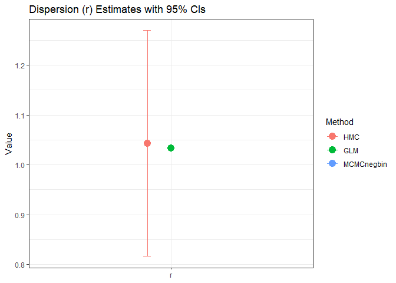

``` r


# HMC trace & density
par(mfrow = c(2, 3), mar = c(4, 4, 2, 1))
for(pn in 1:3) {
  plot(hmc_samps[,pn], type="l", main=paste("HMC Trace:", pn),
       xlab="Iteration", ylab="Value")
  abline(h = hmc_means[pn], col = "red", lty = 2)
}
for(pn in 1:3) {
  d <- density(hmc_samps[,pn])
  plot(d, main=paste("HMC Density:", pn),
       xlab="Value", ylab="Density")
  abline(v = hmc_means[pn], col = "red", lty = 2)
}
```

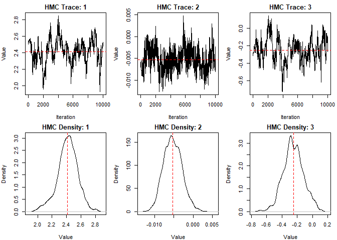

``` r
par(mfrow = c(1, 1))

# RWM trace
for(pn in 1:3) {
  plot(rwm_chain[,pn], type="l", main=paste("RWM Trace:", pn),
       xlab="Iteration", ylab="Value")
  abline(h = rwm_means[pn], col = "blue", lty = 2)
}
```

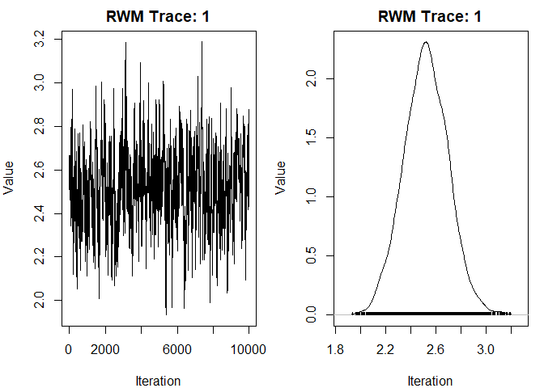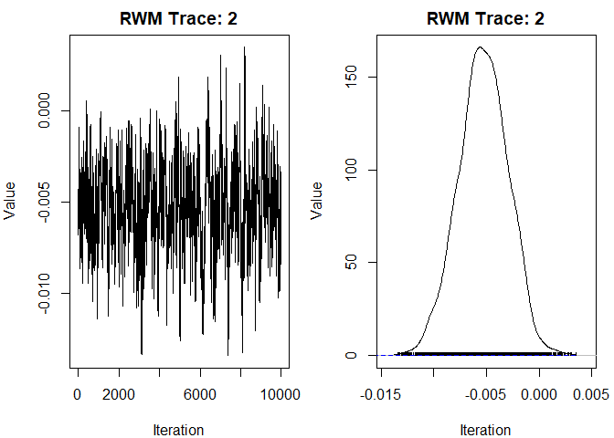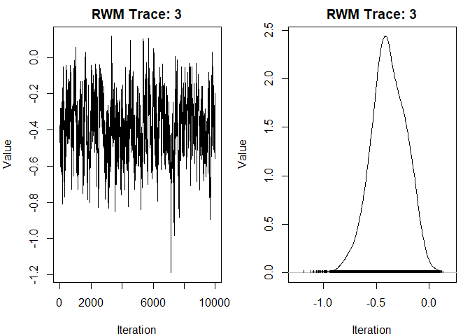

## Real-World Example 2

In this analysis, we investigate the factors influencing the total
number of injuries in traffic accidents. The data come from a traffic
accidents dataset and include predictors such as lighting condition,
number of units involved, day of the week, and month of the crash.
Considering possible overdispersion in the count data, we use a Negative
Binomial regression model. This document demonstrates how to fit the
model using both a traditional approach (via `glm.nb` from the MASS
package) and our custom Hamiltonian Monte Carlo (HMC) sampler.

### Data Preprocessing

We start by reading in the `traffic_accidents.csv` file. The categorical
variables are converted to factors, and numerical values (e.g., number
of units) are properly set as numeric.

``` r
library(NegBinomHMC)
library(MCMCpack)
library(MASS)
library(ggplot2)

accidents <- read.csv("ExampleData/traffic_accidents.csv", stringsAsFactors = TRUE)

accidents$weather_condition <- as.factor(accidents$weather_condition)
accidents$lighting_condition <- as.factor(accidents$lighting_condition)
accidents$crash_day_of_week <- as.factor(accidents$crash_day_of_week)
accidents$crash_month <- as.factor(accidents$crash_month)
accidents$num_units <- as.numeric(as.character(accidents$num_units))

nb_model <- glm.nb(injuries_total ~ lighting_condition + num_units + crash_day_of_week + crash_month,
                   data = accidents)
summary(nb_model)
#> 
#> Call:
#> glm.nb(formula = injuries_total ~ lighting_condition + num_units + 
#>     crash_day_of_week + crash_month, data = accidents, init.theta = 0.7415346039, 
#>     link = log)
#> 
#> Coefficients:
#>                                           Estimate Std. Error z value Pr(>|z|)
#> (Intercept)                              -2.042339   0.035051 -58.267  < 2e-16
#> lighting_conditionDARKNESS, LIGHTED ROAD  0.104313   0.024323   4.289 1.80e-05
#> lighting_conditionDAWN                   -0.049675   0.039932  -1.244 0.213509
#> lighting_conditionDAYLIGHT               -0.152928   0.023708  -6.451 1.11e-10
#> lighting_conditionDUSK                   -0.105643   0.034319  -3.078 0.002082
#> lighting_conditionUNKNOWN                -0.931136   0.048197 -19.319  < 2e-16
#> num_units                                 0.551718   0.008847  62.359  < 2e-16
#> crash_day_of_week2                       -0.123353   0.017131  -7.200 6.00e-13
#> crash_day_of_week3                       -0.161773   0.016949  -9.544  < 2e-16
#> crash_day_of_week4                       -0.133067   0.016857  -7.894 2.93e-15
#> crash_day_of_week5                       -0.161886   0.016827  -9.621  < 2e-16
#> crash_day_of_week6                       -0.194597   0.016417 -11.854  < 2e-16
#> crash_day_of_week7                       -0.115257   0.016531  -6.972 3.12e-12
#> crash_month2                             -0.068891   0.024004  -2.870 0.004105
#> crash_month3                              0.072389   0.023209   3.119 0.001815
#> crash_month4                              0.137530   0.023104   5.953 2.64e-09
#> crash_month5                              0.186414   0.022190   8.401  < 2e-16
#> crash_month6                              0.198024   0.022031   8.989  < 2e-16
#> crash_month7                              0.240459   0.021883  10.988  < 2e-16
#> crash_month8                              0.200943   0.021839   9.201  < 2e-16
#> crash_month9                              0.194849   0.021662   8.995  < 2e-16
#> crash_month10                             0.154989   0.021457   7.223 5.08e-13
#> crash_month11                             0.080318   0.022054   3.642 0.000271
#> crash_month12                             0.017377   0.022093   0.787 0.431551
#>                                             
#> (Intercept)                              ***
#> lighting_conditionDARKNESS, LIGHTED ROAD ***
#> lighting_conditionDAWN                      
#> lighting_conditionDAYLIGHT               ***
#> lighting_conditionDUSK                   ** 
#> lighting_conditionUNKNOWN                ***
#> num_units                                ***
#> crash_day_of_week2                       ***
#> crash_day_of_week3                       ***
#> crash_day_of_week4                       ***
#> crash_day_of_week5                       ***
#> crash_day_of_week6                       ***
#> crash_day_of_week7                       ***
#> crash_month2                             ** 
#> crash_month3                             ** 
#> crash_month4                             ***
#> crash_month5                             ***
#> crash_month6                             ***
#> crash_month7                             ***
#> crash_month8                             ***
#> crash_month9                             ***
#> crash_month10                            ***
#> crash_month11                            ***
#> crash_month12                               
#> ---
#> Signif. codes:  0 '***' 0.001 '**' 0.01 '*' 0.05 '.' 0.1 ' ' 1
#> 
#> (Dispersion parameter for Negative Binomial(0.7415) family taken to be 1)
#> 
#>     Null deviance: 154736  on 209305  degrees of freedom
#> Residual deviance: 149258  on 209282  degrees of freedom
#> AIC: 334924
#> 
#> Number of Fisher Scoring iterations: 1
#> 
#> 
#>               Theta:  0.74153 
#>           Std. Err.:  0.00925 
#> 
#>  2 x log-likelihood:  -334874.20000

nb_formula <- injuries_total ~ lighting_condition + num_units + crash_day_of_week + crash_month
X <- model.matrix(nb_formula, data = accidents)
y <- accidents$injuries_total

beta_mu <- rep(0, ncol(X))
beta_sigma <- rep(10, ncol(X))

initial_beta <- rep(0, ncol(X))

initial_epsilon <- 0.1 
L <- 10 
n_iter <- 1000
n_warmup <- 500
target_accept <- 0.65
alpha_r <- 5    # Gamma prior shape for r
beta_r <- 2     # Gamma prior rate for r, mean = 5/2 = 2.5

hmc_result <- hmc_sampler(
  log_post = log_posterior_negbin_log_r,
  grad_log_post = grad_log_posterior_negbin_log_r,
  initial_theta = c(initial_beta, log(0.74)),  # Initial beta = 0, phi = log(0.74)
  initial_epsilon = initial_epsilon,
  L = L,
  n_iter = n_iter,
  n_warmup = n_warmup,
  X = X,
  y = y,
  beta_mu = beta_mu,
  beta_sigma = beta_sigma,
  alpha_r = alpha_r,
  beta_r = beta_r,
  target_accept = target_accept
)

samples <- hmc_result$samples
accept_rate <- hmc_result$acceptance_rate
final_epsilon <- hmc_result$final_epsilon

cat("HMC acceptance rate:", accept_rate, "\n")
#> HMC acceptance rate: 0.77
cat("final epsilon:", final_epsilon, "\n")
#> final epsilon: 0.002311489

# Transform phi samples to r
r_samples <- exp(samples[, ncol(X) + 1])
posterior_means <- c(colMeans(samples[, 1:ncol(X)]), mean(r_samples))
names(posterior_means) <- c(colnames(X), "r")
cat("HMC posterior mean:\n")
#> HMC posterior mean:
print(posterior_means)
#>                              (Intercept) 
#>                              -2.04334284 
#> lighting_conditionDARKNESS, LIGHTED ROAD 
#>                               0.10711378 
#>                   lighting_conditionDAWN 
#>                              -0.04332536 
#>               lighting_conditionDAYLIGHT 
#>                              -0.15000531 
#>                   lighting_conditionDUSK 
#>                              -0.10200016 
#>                lighting_conditionUNKNOWN 
#>                              -0.92864280 
#>                                num_units 
#>                               0.55147145 
#>                       crash_day_of_week2 
#>                              -0.12327345 
#>                       crash_day_of_week3 
#>                              -0.16214471 
#>                       crash_day_of_week4 
#>                              -0.13368361 
#>                       crash_day_of_week5 
#>                              -0.16190569 
#>                       crash_day_of_week6 
#>                              -0.19455328 
#>                       crash_day_of_week7 
#>                              -0.11562203 
#>                             crash_month2 
#>                              -0.07086412 
#>                             crash_month3 
#>                               0.07094604 
#>                             crash_month4 
#>                               0.13580236 
#>                             crash_month5 
#>                               0.18452351 
#>                             crash_month6 
#>                               0.19668258 
#>                             crash_month7 
#>                               0.23843992 
#>                             crash_month8 
#>                               0.19947033 
#>                             crash_month9 
#>                               0.19370232 
#>                            crash_month10 
#>                               0.15480698 
#>                            crash_month11 
#>                               0.08021276 
#>                            crash_month12 
#>                               0.01689081 
#>                                        r 
#>                               0.74170725

cat("glm model estimated coefficients:\n")
#> glm model estimated coefficients:
print(c(coef(nb_model), theta = nb_model$theta))
#>                              (Intercept) 
#>                              -2.04233876 
#> lighting_conditionDARKNESS, LIGHTED ROAD 
#>                               0.10431344 
#>                   lighting_conditionDAWN 
#>                              -0.04967474 
#>               lighting_conditionDAYLIGHT 
#>                              -0.15292814 
#>                   lighting_conditionDUSK 
#>                              -0.10564299 
#>                lighting_conditionUNKNOWN 
#>                              -0.93113615 
#>                                num_units 
#>                               0.55171830 
#>                       crash_day_of_week2 
#>                              -0.12335267 
#>                       crash_day_of_week3 
#>                              -0.16177324 
#>                       crash_day_of_week4 
#>                              -0.13306748 
#>                       crash_day_of_week5 
#>                              -0.16188641 
#>                       crash_day_of_week6 
#>                              -0.19459695 
#>                       crash_day_of_week7 
#>                              -0.11525677 
#>                             crash_month2 
#>                              -0.06889150 
#>                             crash_month3 
#>                               0.07238907 
#>                             crash_month4 
#>                               0.13752991 
#>                             crash_month5 
#>                               0.18641419 
#>                             crash_month6 
#>                               0.19802407 
#>                             crash_month7 
#>                               0.24045914 
#>                             crash_month8 
#>                               0.20094291 
#>                             crash_month9 
#>                               0.19484940 
#>                            crash_month10 
#>                               0.15498857 
#>                            crash_month11 
#>                               0.08031843 
#>                            crash_month12 
#>                               0.01737741 
#>                                    theta 
#>                               0.74153460

ci_length <- apply(cbind(samples[, 1:ncol(X)], r_samples), 2, function(x) {
  quantile(x, 0.975) - quantile(x, 0.025)
})
print("Length of 95% CI for each parameter:")
#> [1] "Length of 95% CI for each parameter:"
print(ci_length)
#>                                                                              
#> 0.15661409 0.10285318 0.16236817 0.10150139 0.14183421 0.20348783 0.03590899 
#>                                                                              
#> 0.06359910 0.06788787 0.06847695 0.06963274 0.06335045 0.06041826 0.08930068 
#>                                                                              
#> 0.08498350 0.08719351 0.08295272 0.08351210 0.08716865 0.08093465 0.08188367 
#>                                   r_samples 
#> 0.08519391 0.08645246 0.08265197 0.03425373

# Metropolis model using MCMCnegbin
iterations <- 1000
chain_metropolis <- MCMCnegbin(
  formula = nb_formula,
  data = accidents,
  burnin = 0,  # No burn-in
  mcmc = iterations - 1,  # Include initial value
  tune = 1,  # Tuning parameter for proposal
  b0 = beta_mu,  # Prior mean for beta
  B0 = diag(1/beta_sigma^2, ncol(X)),  # Prior precision for beta
  a0 = alpha_r,  # Gamma prior shape for r
  c0 = beta_r,   # Gamma prior rate for r
  verbose = 0
)

cat("Random Walk Metropolis acceptance rate:", 1 - mean(rowSums(chain_metropolis[-1, ] == chain_metropolis[-nrow(chain_metropolis), ]) == ncol(chain_metropolis)), "\n")
#> Random Walk Metropolis acceptance rate: 1
rwm_posterior_means <- colMeans(chain_metropolis)
names(rwm_posterior_means) <- colnames(X)
cat("Random Walk Metropolis posterior mean:\n")
#> Random Walk Metropolis posterior mean:
print(rwm_posterior_means)
#>                              (Intercept) 
#>                             -2.023463865 
#> lighting_conditionDARKNESS, LIGHTED ROAD 
#>                              0.089264191 
#>                   lighting_conditionDAWN 
#>                             -0.053483219 
#>               lighting_conditionDAYLIGHT 
#>                             -0.167246144 
#>                   lighting_conditionDUSK 
#>                             -0.119801679 
#>                lighting_conditionUNKNOWN 
#>                             -0.948925994 
#>                                num_units 
#>                              0.553735593 
#>                       crash_day_of_week2 
#>                             -0.127188016 
#>                       crash_day_of_week3 
#>                             -0.165642507 
#>                       crash_day_of_week4 
#>                             -0.134890940 
#>                       crash_day_of_week5 
#>                             -0.162415644 
#>                       crash_day_of_week6 
#>                             -0.191870060 
#>                       crash_day_of_week7 
#>                             -0.114889314 
#>                             crash_month2 
#>                             -0.073562344 
#>                             crash_month3 
#>                              0.061346501 
#>                             crash_month4 
#>                              0.135515701 
#>                             crash_month5 
#>                              0.178948817 
#>                             crash_month6 
#>                              0.184271849 
#>                             crash_month7 
#>                              0.231108582 
#>                             crash_month8 
#>                              0.189238778 
#>                             crash_month9 
#>                              0.191707619 
#>                            crash_month10 
#>                              0.143632451 
#>                            crash_month11 
#>                              0.070000867 
#>                            crash_month12 
#>                              0.008667882

ci_length <- apply(chain_metropolis, 2, function(x) {
  quantile(x, 0.975) - quantile(x, 0.025)
})
print("Length of 95% CI for each parameter (RWM, beta only):")
#> [1] "Length of 95% CI for each parameter (RWM, beta only):"
print(ci_length)
#>                              (Intercept) 
#>                               0.12406558 
#> lighting_conditionDARKNESS, LIGHTED ROAD 
#>                               0.10365933 
#>                   lighting_conditionDAWN 
#>                               0.17820336 
#>               lighting_conditionDAYLIGHT 
#>                               0.10095217 
#>                   lighting_conditionDUSK 
#>                               0.12744340 
#>                lighting_conditionUNKNOWN 
#>                               0.20546951 
#>                                num_units 
#>                               0.02616165 
#>                       crash_day_of_week2 
#>                               0.07614653 
#>                       crash_day_of_week3 
#>                               0.05321622 
#>                       crash_day_of_week4 
#>                               0.06513628 
#>                       crash_day_of_week5 
#>                               0.05878904 
#>                       crash_day_of_week6 
#>                               0.06361526 
#>                       crash_day_of_week7 
#>                               0.06611267 
#>                             crash_month2 
#>                               0.08385201 
#>                             crash_month3 
#>                               0.07314763 
#>                             crash_month4 
#>                               0.07897411 
#>                             crash_month5 
#>                               0.07729121 
#>                             crash_month6 
#>                               0.06624802 
#>                             crash_month7 
#>                               0.07525514 
#>                             crash_month8 
#>                               0.07586145 
#>                             crash_month9 
#>                               0.08018449 
#>                            crash_month10 
#>                               0.06094120 
#>                            crash_month11 
#>                               0.07082001 
#>                            crash_month12 
#>                               0.07621908

# ===== Compute HMC estimates and CI =====
hmc_mean <- posterior_means
hmc_ci_lower <- apply(cbind(samples[, 1:ncol(X)], r_samples), 2, quantile, probs = 0.025)
hmc_ci_upper <- apply(cbind(samples[, 1:ncol(X)], r_samples), 2, quantile, probs = 0.975)

# ===== Compute RWM estimates and CI =====
rwm_mean <- rwm_posterior_means
rwm_ci_lower <- apply(chain_metropolis, 2, quantile, probs = 0.025)
rwm_ci_upper <- apply(chain_metropolis, 2, quantile, probs = 0.975)

# ===== Compute GLM estimates and CI =====
glm_coef <- c(coef(nb_model), theta = nb_model$theta)
# Align glm_coef with params
params <- c(colnames(X), "r")
glm_coef_aligned <- numeric(length(params))
names(glm_coef_aligned) <- params
glm_coef_names <- names(coef(nb_model))
for (name in glm_coef_names) {
  if (name %in% colnames(X)) glm_coef_aligned[name] <- coef(nb_model)[name]
}
glm_coef_aligned["r"] <- nb_model$theta

# Create glm_ci with NA for missing coefficients
glm_ci <- matrix(NA, nrow = length(params), ncol = 2)
rownames(glm_ci) <- params
colnames(glm_ci) <- c("2.5%", "97.5%")
confint_glm <- confint(nb_model)
#> Waiting for profiling to be done...
for (name in rownames(confint_glm)) {
  if (name %in% colnames(X)) glm_ci[name, ] <- confint_glm[name, ]
}
glm_ci["r", ] <- c(NA, NA)


# Diagnostic prints to check dimensions
cat("Number of parameters (p + 1):", length(params), "\n")
#> Number of parameters (p + 1): 25
cat("Length of hmc_mean:", length(hmc_mean), "\n")
#> Length of hmc_mean: 25
cat("Length of glm_coef_aligned:", length(glm_coef_aligned), "\n")
#> Length of glm_coef_aligned: 25
cat("Length of rwm_mean:", length(rwm_mean), "\n")
#> Length of rwm_mean: 24
cat("Number of rows in glm_ci:", nrow(glm_ci), "\n")
#> Number of rows in glm_ci: 25

# ===== Prepare a data frame for plotting beta parameters =====
df_beta <- data.frame(
  Parameter = rep(params[1:24], 3),
  Method = factor(rep(c("HMC", "GLM", "RWM"), each = 24)),
  Estimate = c(hmc_mean[1:24], glm_coef_aligned[1:24], rwm_mean),
  CI_Lower = c(hmc_ci_lower[1:24], glm_ci[1:24, 1], rwm_ci_lower),
  CI_Upper = c(hmc_ci_upper[1:24], glm_ci[1:24, 2], rwm_ci_upper)
)

df_beta$Parameter <- factor(df_beta$Parameter, levels = params[1:24])

# ===== Create the plot for beta parameters =====
ggplot(df_beta, aes(x = Parameter, y = Estimate, color = Method)) +
  geom_point(position = position_dodge(width = 0.6), size = 3) +
  geom_errorbar(aes(ymin = CI_Lower, ymax = CI_Upper),
                width = 0.2,
                position = position_dodge(width = 0.6)) +
  theme_bw() +
  labs(title = "Beta Parameter Estimates with 95% Intervals",
       x = "Parameter",
       y = "Coefficient Value") +
  theme(axis.text.x = element_text(angle = 45, hjust = 1))
```

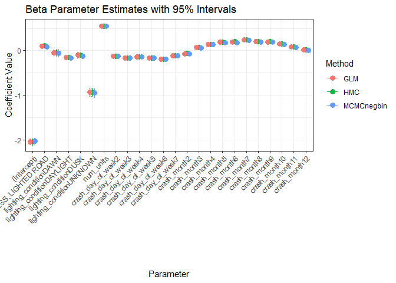

``` r

# ===== Prepare a data frame for plotting r (HMC and GLM only) =====
df_r <- data.frame(
  Parameter = rep("r", 2),
  Method = factor(c("HMC", "GLM")),
  Estimate = c(hmc_mean["r"], glm_coef_aligned["r"]),
  CI_Lower = c(hmc_ci_lower["r_samples"], glm_ci["r", 1]),
  CI_Upper = c(hmc_ci_upper["r"], glm_ci["r", 2])
)

# ===== Create the plot for r =====
ggplot(df_r, aes(x = Parameter, y = Estimate, color = Method)) +
  geom_point(position = position_dodge(width = 0.2), size = 3) +
  geom_errorbar(aes(ymin = CI_Lower, ymax = CI_Upper),
                width = 0.1,
                position = position_dodge(width = 0.2)) +
  theme_bw() +
  labs(title = "Dispersion Parameter (r) Estimates with 95% Intervals",
       x = "Parameter",
       y = "Value") +
  theme(axis.text.x = element_text(hjust = 0.5))
```

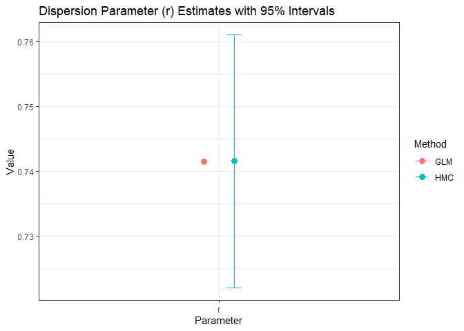

``` r

first_three <- params[1:3]

colnames(samples) <- c(colnames(X), "r")
colnames(chain_metropolis) <- colnames(X)

# --- Set up the plotting area: 2 rows (first row for HMC, second row for RWM), 3 columns ---
par(mfrow = c(2, 3), mar = c(4, 4, 2, 1))

# --- Generate trace plots for HMC and add mean line ---
for (i in 1:3) {
  param_name <- first_three[i]
  plot(samples[, param_name],
       type = "l",
       main = paste("HMC Trace:", param_name),
       xlab = "Iteration",
       ylab = "Value")
  
  hmc_mean_val <- mean(samples[, param_name])
  
  abline(h = hmc_mean_val, col = "red", lwd = 2, lty = 2)
  
  legend("topright", legend = paste("Mean:", round(hmc_mean_val, 3)), 
         bty = "n", col = "red", lty = 2, cex = 0.8)
}

# density plot
for (i in 1:3) {
  param_name <- first_three[i]
  plot(density(samples[, param_name]), 
       main = paste("HMC Density:", param_name),
       xlab = "Value",
       ylab = "Density")
  hmc_mean_val <- mean(samples[, param_name])
  abline(v = hmc_mean_val, col = "red", lwd = 2, lty = 2)
  
  legend("topright", legend = paste("Mean:", round(hmc_mean_val, 3)), 
         bty = "n", col = "red", lty = 2, cex = 0.8)
}
```

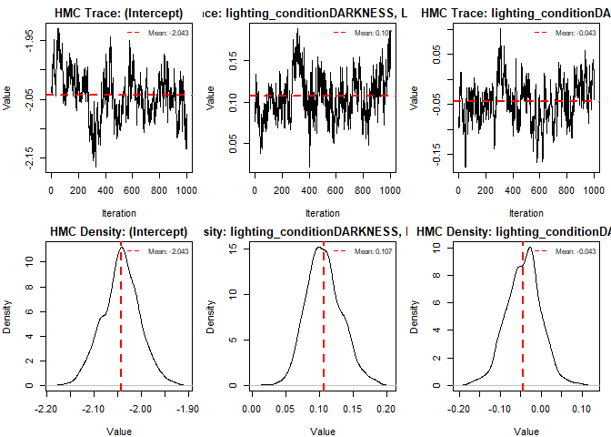

``` r

# --- Generate trace plots for RWM and add mean line ---
for (i in 1:3) {
  param_name <- first_three[i]
  plot(chain_metropolis[, param_name],
       type = "l",
       main = paste("RWM Trace:", param_name),
       xlab = "Iteration",
       ylab = "Value")
  
  rwm_mean_val <- mean(chain_metropolis[, param_name])
  
  abline(h = rwm_mean_val, col = "blue", lwd = 2, lty = 2)
  
  legend("topright", legend = paste("Mean:", round(rwm_mean_val, 3)), 
         bty = "n", col = "blue", lty = 2, cex = 0.8)
}
```

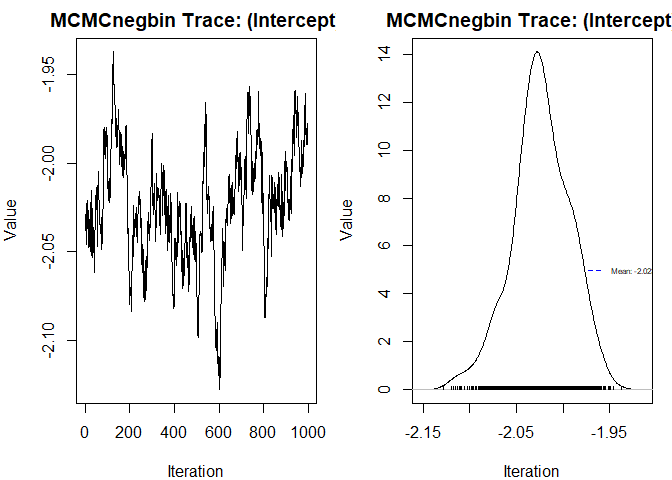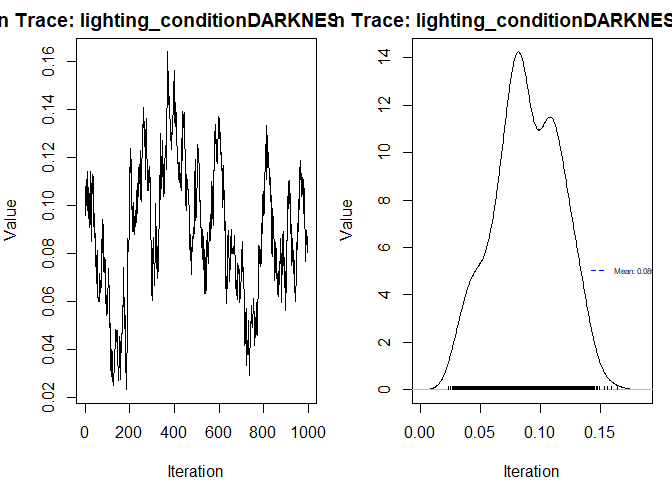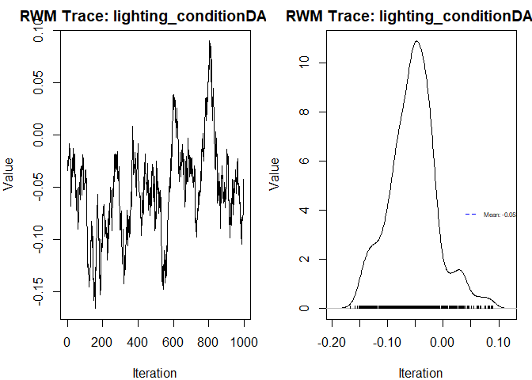

``` r

# Reset the plotting layout to one plot per window
par(mfrow = c(1, 1))
```

## Contributing

Contributions to NegBinomHMC are welcome. If you encounter issues or
have suggestions for improvements, please feel free to open an issue or
submit a pull request on the GitHub repository.

## License

This project is licensed under the MIT License. See the LICENSE file for
details.

## Contact

For questions or further information, please contact Weixiong at
\[<wxhua@umich.edu>\].
